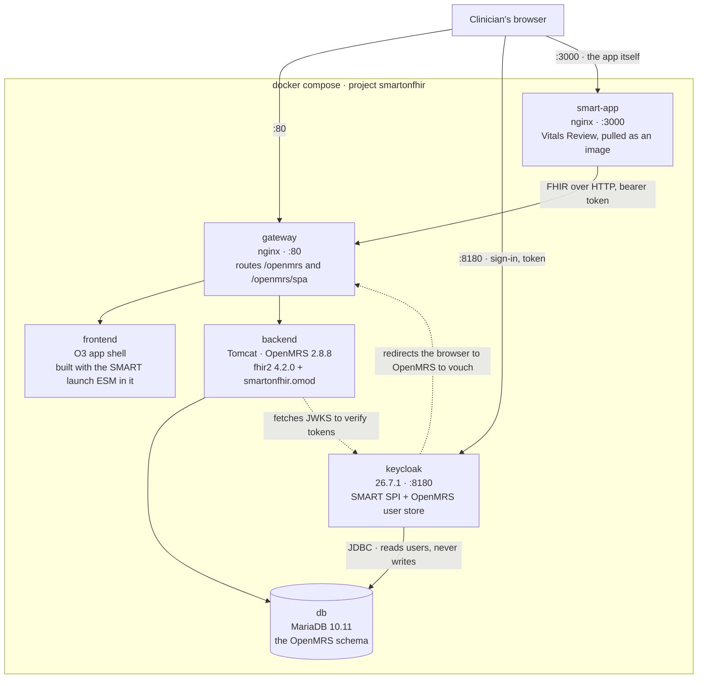
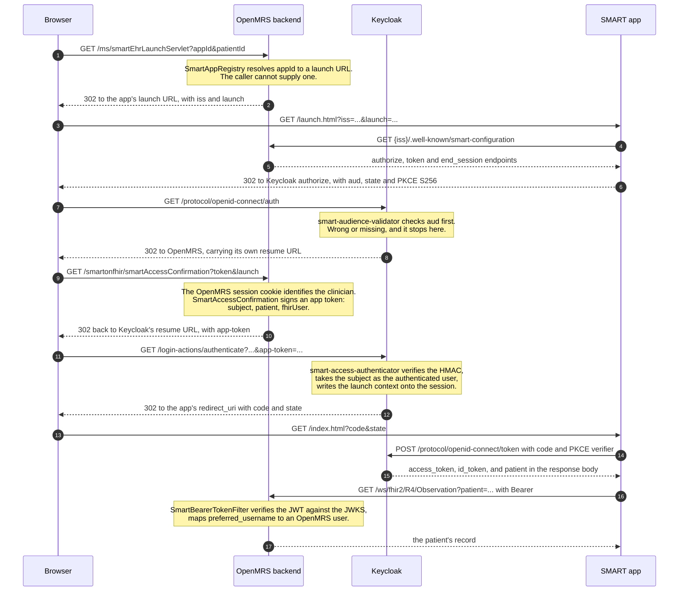
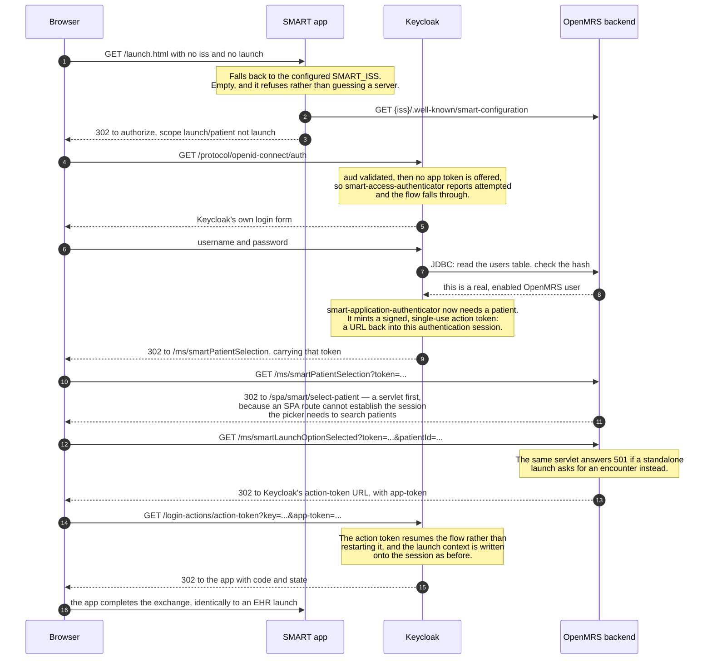

# How this fits together

Six containers, three repositories' worth of Java and JavaScript, and one handshake that has to cross all
of them. This document is the low-level view: which component does what, what moves between them, and
where the trust actually comes from.

The redirect chains below are not illustrative — they are
[`launch-redirects.txt`](launch-redirects.txt), recorded from a real launch by the Playwright capture.

## The containers



Three things in that picture are easy to miss.

**Keycloak reads the OpenMRS database directly.** The user federation provider queries the `users` and
`provider` tables over JDBC, so a clinician signs in with the OpenMRS password they already have and
there is no second directory to keep in step. It never writes.

**The app never talks to the backend privately.** It calls the FHIR API through the same gateway a browser
does, with a bearer token. Nothing about it is inside the deployment — swap in any other SMART app and the
picture is unchanged.

**The backend calls Keycloak too**, for one thing only: fetching the JWKS it verifies access tokens
against. That is the single dependency the FHIR side has on the authorization server.

## Where each piece comes from

| Repository | Artefact | Runs in |
|---|---|---|
| [openmrs-module-smartonfhir](https://github.com/mherman22/openmrs-module-smartonfhir) | `smartonfhir.omod` | backend — discovery, launch handles, bearer authentication |
| [openmrs-contrib-keycloak-smart-auth](https://github.com/mherman22/openmrs-contrib-keycloak-smart-auth) | `keycloak-smart-auth.jar` | keycloak — SMART's OAuth2 extensions |
| [openmrs-contrib-keycloak-auth](https://github.com/mherman22/openmrs-contrib-keycloak-auth) | `openmrs-keycloak-userstore.jar` | keycloak — OpenMRS as the user store |
| [openmrs-esm-smart-app-launch-app](https://github.com/mherman22/openmrs-esm-smart-app-launch-app) | packed tarball | frontend — the chart action and the patient picker |
| [openmrs-smart-vitals-reviews-app](https://github.com/mherman22/openmrs-smart-vitals-reviews-app) | published image | smart-app — the SMART application |
| this repository | `keycloak/realm/openmrs-realm.json` | keycloak — the wiring that makes the providers reachable |

## The moving parts inside each container

**In the backend** (`smartonfhir.omod`), reached under `/openmrs`:

| Path | Class | Job |
|---|---|---|
| `/ws/fhir2/R4/.well-known/smart-configuration` | `SmartConfigServlet` | the discovery document, and the capability list |
| `/ms/smartEhrLaunchServlet` | `SmartEhrLaunchServlet` | starts an EHR launch; mints the launch handle |
| `/ms/smartApps` | `SmartAppsServlet` | which apps may be launched, for the chart menu |
| `/smartonfhir/smartAccessConfirmation` | `SmartAccessConfirmation` | vouches for the signed-in clinician, and mints the app token |
| `/ms/smartPatientSelection` | `SmartPatientSelectionServlet` | entry point for choosing a patient in a standalone launch |
| every FHIR request | `SmartBearerTokenFilter` → `SmartBearerTokenAuthenticationScheme` | verifies the bearer token and binds the request to an OpenMRS user |

**In Keycloak**, registered by the realm's browser flow:

| Provider id | Job |
|---|---|
| `smart-audience-validator` | rejects an authorize request whose `aud` is missing or names another server |
| `smart-access-authenticator` | carries an **EHR** launch: asks OpenMRS to vouch, accepts the signed app token instead of a password |
| `smart-application-authenticator` | carries a **standalone** launch: sends the clinician to OpenMRS to pick a patient |
| `smart-username-password-form` | Keycloak's own login form, re-registered so it can be an `ALTERNATIVE` |
| `smart-context-claim-mapper` | writes `patient`, `encounter` and `fhirUser` into the token response, access token and id_token |
| `openmrs-authentication-provider` | the user store: authenticates against the OpenMRS `users` table |

## An EHR launch, on the wire

The clinician is already signed in to OpenMRS and looking at a patient. No password is asked for, and no
Keycloak login page appears — that is the whole point of this flow.



Two hops there are the ones people are surprised by. **Step 8** is Keycloak handing the browser to
OpenMRS mid-authentication, because OpenMRS is the only party that knows who is signed in. **Step 11** is
OpenMRS handing it back with a signed assertion instead of a password — which is why the shared secret
below matters as much as it does.

## A standalone launch, on the wire

Nobody is signed in anywhere. The app knows only its own configured FHIR server, so the authorization
server has to establish both the user and the patient.



The visible difference is one screen: **a standalone launch shows Keycloak's login page, an EHR launch
never does.** Everything after the token response is identical, which is why the app implements both with
one code path and a different scope.

## What authenticates what

Four different trust mechanisms are in play, and mixing them up is the source of most confusion.

| Between | Mechanism | Direction |
|---|---|---|
| OpenMRS ↔ Keycloak, during a launch | **HMAC** with a shared secret, `SMART_LAUNCH_SECRET` | both ways: OpenMRS signs the app token, Keycloak signs the patient-selection token |
| App → Keycloak, at the token endpoint | **PKCE `S256`**, no client secret | the app proves it started the flow it is finishing |
| App → FHIR API | **Bearer JWT**, verified against Keycloak's **JWKS** | asymmetric; the backend needs no secret, only the public keys |
| Keycloak → OpenMRS database | **JDBC**, read-only | Keycloak reads password hashes; it never writes |

The shared secret is the one to be careful with. Anything able to sign with it can assert **any username**
to Keycloak without a password, because that is exactly what an EHR launch does. It has no default in
either repository — a missing key rejects every launch rather than falling back to something guessable.

The audience is the other half. `aud` must name this FHIR server, it is checked before the clinician is
ever asked to sign in, and the token carries it, so a token minted for one FHIR server cannot be replayed
against another on the same realm.

## Where launch context lives, and for how long

A launch handle is a random id in an in-memory cache in the backend, not a signed token and not a database
row. It is single-use, short-lived, and **local to the node that minted it** — so more than one backend
behind a load balancer needs sticky sessions for the launch window, or a shared cache.

Once Keycloak has it, the context lives as notes on the Keycloak user session, and `smart-context-claim-mapper`
copies it into three places: the **token response body**, which is where SMART says it belongs and what an
app reads; the **access token**, so a resource server can see which patient a token was scoped to; and the
**id_token**, which is where `fhirUser` goes. Every note is rewritten on every launch — blank where a
launch establishes nothing — because the session outlives a single launch and a stale note would hand the
next app the previous patient.

## Launching an application this project did not write

The point of SMART is that the server does not care whose application it is. Two changes were needed
before an off-the-shelf application could even be registered, and both are worth keeping:

- **A client whose id the app actually sends.** An app registered elsewhere sends whatever client id it
  was built with, so the realm needs a client with that exact id and that app's redirect URI.
- **The wildcard scopes such apps ask for.** `patient/*.*` and `user/*.*` are refused outright by
  Keycloak, which will not expand a wildcard -- a scope must exist as a client scope to be requestable.
  Both are defined as empty markers, and **only on the third-party client**: `smartClient` still answers
  `invalid_scope` for them, deliberately. Nothing here enforces scopes, so a granted wildcard grants
  nothing today; the day enforcement lands it becomes a claim that must be honoured or withdrawn.

With those in place, the server side works end to end. Registering
[SMART Health IT's sample app](https://launch.smarthealthit.org) and launching it produced:

```
302  localhost/openmrs/ms/smartEhrLaunchServlet?appId=...&patientId=...
200  launch.smarthealthit.org/sample-app/launch?iss=http://localhost/openmrs/ws/fhir2/R4&launch=...
```

The registry resolved an application it does not host, minted a launch handle, and handed the browser
over with the two parameters the specification requires. That much is proven.

### Two reasons it did not complete, only one of which is about this server

**That particular app is not portable.** It base64-decodes the `launch` parameter and parses it as JSON
-- `atob("abc123")` is `i\xb75\xdb`, and the app fails with `SyntaxError: Unexpected token 'i'`. SMART
requires an application to treat `launch` as opaque and hand it back unread; this one expects the
encoded context its own launcher puts there. It is a companion to that launcher rather than a portable
SMART app, so it cannot work against any other EHR, including this one. Choosing it was a mistake.

**A publicly hosted app cannot reach a server on localhost.** Independently of the above, a fetch from
`https://launch.smarthealthit.org` to our discovery document is refused by the browser:

```
Access to fetch at 'http://localhost/openmrs/ws/fhir2/R4/.well-known/smart-configuration'
from origin 'https://launch.smarthealthit.org' has been blocked by CORS policy:
Permission was denied for this request to access the `loopback` address space.
```

That is the browser's private-network rule, not a CORS failure: our headers are correct -- a preflight
from that origin is answered `Access-Control-Allow-Origin: *` with the `Authorization` header permitted,
and `curl` completes the request. A browser refuses before CORS is consulted. So any hosted third-party
app will fail against a laptop deployment and would work against a routable hostname.

### What would actually prove it

An application that treats `launch` as opaque, running somewhere the browser will let reach localhost --
which means self-hosted. For conformance specifically the right instrument is
[Inferno](https://inferno-framework.github.io/)'s SMART App Launch suite: it is a test client rather
than a sample app, it runs in Docker beside this stack, and it reads the specification rather than
this project's assumptions. It has never been run here, and is the largest untested claim remaining.
