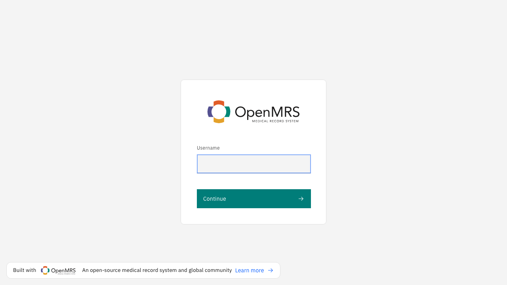
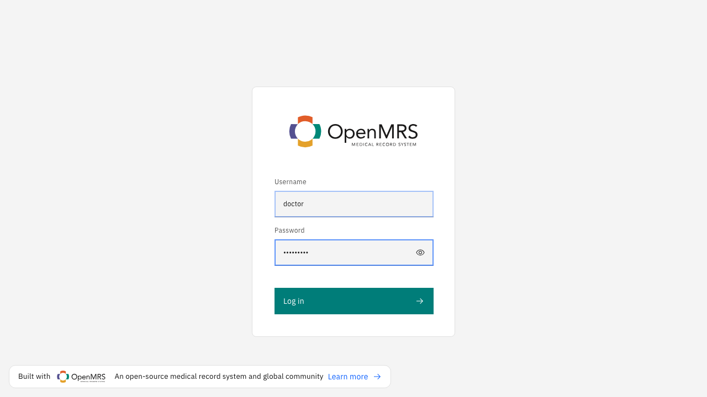
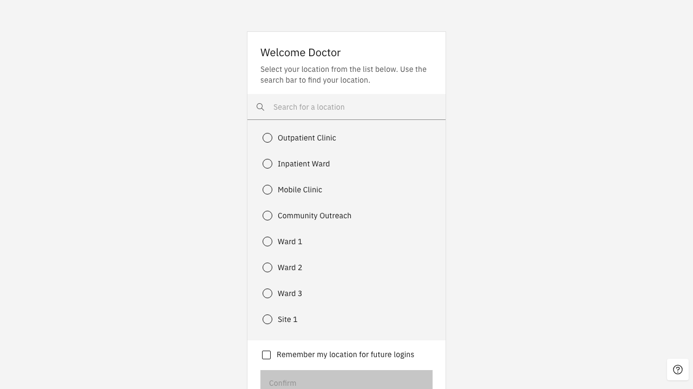
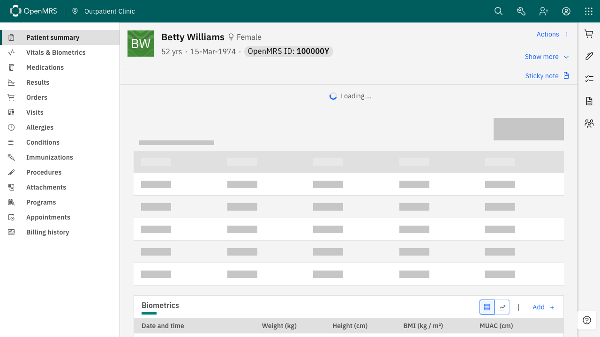
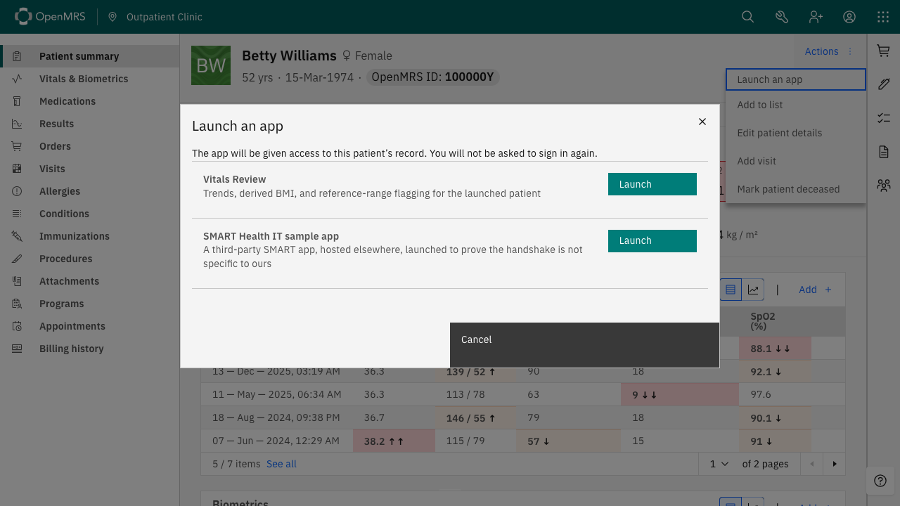
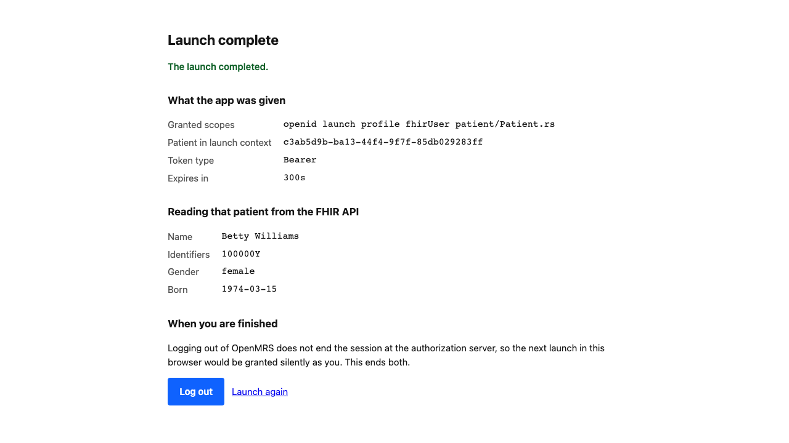
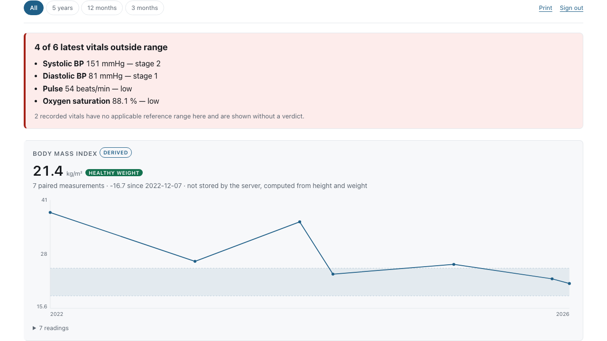

# An EHR launch, step by step

A clinician working in a patient's chart opens a SMART application, and it comes up already holding that
patient's record — no second sign-in, nothing typed. This is that flow, photographed against this stack.

Every screenshot below was taken by `capture-walkthrough.spec.ts` in
[openmrs-esm-smart-app-launch-app](https://github.com/mherman22/openmrs-esm-smart-app-launch-app), which
asserts at each step before it photographs. A walkthrough illustrated with pictures of a broken flow is
worse than no walkthrough.

## 1 · Sign in to OpenMRS

An ordinary OpenMRS login. Worth noticing what does *not* happen here: nothing contacts Keycloak. At this
point the browser holds one cookie, `JSESSIONID`, and no Keycloak session exists at all. That matters
later.







## 2 · Open a patient's chart

The chart shows this patient's vitals as OpenMRS records them: blood pressure 151/81, pulse 54, oxygen
saturation 88.1%, and a BMI of 21.4. Keep those numbers in mind.



## 3 · Launch an app

**Launch an app** comes from the frontend module, placed in the chart's action menu by
`frontend/config-core_demo.json`. The apps it offers come from the server — the
apps registered through `/ws/rest/v1/smartapp` — not from the browser, so a deployment decides what
may be launched and a page cannot ask for more.



## 4 · The app opens, already holding the patient



No login screen appeared. The application knows which patient to show, and it did not ask.

Look at what it is doing. It is not displaying the record back:

- **four of six latest vitals are outside their reference range**, named, with blood pressure staged the
  way the 2017 ACC/AHA guideline stages it — 151 systolic is stage 2, 81 diastolic is stage 1
- **two vitals are shown without a verdict**, because weight and height have no adult reference range and
  saying nothing is better than implying one
- **the body mass index is derived.** OpenMRS stores height and weight and no BMI, so 21.4 was computed
  by the application from paired measurements taken on the same day



Those numbers agree with the chart in step 2 — same pressures, same pulse, same saturation, same BMI —
which is the point: two independent readings of one record.

The controls along the top belong to the application, not to OpenMRS. **Sign out** ends the authorization
server's session as well as the app's, because closing the tab leaves that session open and the next
launch is then granted silently as whoever launched last. The period chips narrow every chart, measured
back from the most recent reading rather than from today.

And none of this was built here. The application is released on its own and pulled as an image —
[openmrs-smart-vitals-reviews-app](https://github.com/mherman22/openmrs-smart-vitals-reviews-app) — which
is what a site does with any third-party SMART app. It was given a client id and a FHIR server through
its environment and nothing else; it has no knowledge of this distribution, and this distribution holds
none of its source.

## What happened on the wire

Everything below was recorded during this walkthrough, credentials redacted and the shape kept. The
sequence is in [`launch-redirects.txt`](launch-redirects.txt); the request and response blocks under each
hop are written by the same run, so neither can drift from what the code does.

```
302  /openmrs/ms/smartEhrLaunchServlet?appId=vitalsreview&patientId=…
200  localhost:3000/launch.html?iss=…&launch=<launch handle>
302  keycloak /protocol/openid-connect/auth?response_type=code&client_id=smartClient&…
302  /openmrs/smartonfhir/smartAccessConfirmation?token=…&launch=<launch handle>
302  keycloak /login-actions/authenticate?…&app-token=<signed launch token>
200  localhost:3000/index.html?state=<state>&code=<authorization code>
```

Six hops, and the interesting one is the fourth.

**Hop 1.** OpenMRS mints a launch handle — 256 bits from a CSPRNG, single-use, and bound to the clinician
who minted it — and redirects the browser to the application's launch URL, which it looks up in the app
registry rather than accepting from the request. Note that `appId` names the app and the `Location` is the
address the registry holds for it; nothing in the request could have changed where this goes.

<!-- wire:ehr-launch -->

```http
GET /openmrs/ms/smartEhrLaunchServlet?appId=vitalsreview&patientId=2e3c5f55-bb41-4ff2-a93b-c0851390f9fa
Host: localhost
Accept: text/html,application/xhtml+xml,application/xml;q=0.9,image/avif,image/webp,image/apng,*/*;q=0.8,application/signed-exchange;v=b3;q=0.7
```
```http
302 Found
Location: http://localhost:3000/launch.html?iss=http%3A%2F%2Flocalhost%2Fopenmrs%2Fws%2Ffhir2%2FR4&launch=<launch handle>
```

<!-- /wire:ehr-launch -->

**Hop 2.** The application reads `{iss}/.well-known/smart-configuration`, which is served by
`SmartConfigServlet` from the `smart.*` runtime properties. This is the only place the application learns where
to authorize; it is given a FHIR base URL through its environment and discovers the rest.

<!-- wire:discovery -->

```http
GET /openmrs/ws/fhir2/R4/.well-known/smart-configuration
Host: localhost
Accept: application/json
```
```http
200 OK
```
```json
{
  "authorization_endpoint": "http://localhost:8180/realms/openmrs/protocol/openid-connect/auth",
  "token_endpoint": "http://localhost:8180/realms/openmrs/protocol/openid-connect/token",
  "token_endpoint_auth_methods_supported": [
    "client_secret_basic",
    "private_key_jwt"
  ],
  "scopes_supported": [
    "openid",
    "profile",
    "fhirUser",
    "launch",
    "launch/patient",
    "launch/encounter",
    "patient/Patient.rs",
    "patient/Observation.rs",
    "patient/Condition.rs",
    "patient/Encounter.rs",
    "offline_access"
  ],
  "response_types_supported": [
    "code"
  ],
  "revocation_endpoint": "http://localhost:8180/realms/openmrs/protocol/openid-connect/revoke",
  "end_session_endpoint": "http://localhost:8180/realms/openmrs/protocol/openid-connect/logout",
  "capabilities": [
    "launch-ehr",
    "launch-standalone",
    "client-public",
    "client-confidential-symmetric",
    "context-ehr-patient",
    "context-standalone-patient",
    "sso-openid-connect"
  ],
  "issuer": "http://localhost:8180/realms/openmrs",
  "jwks_uri": "http://localhost:8180/realms/openmrs/protocol/openid-connect/certs",
  "grant_types_supported": [
    "authorization_code",
    "refresh_token"
  ],
  "code_challenge_methods_supported": [
    "S256"
  ]
}
```

<!-- /wire:discovery -->

**Hop 3.** It then redirects to the authorization server with `aud`, the launch handle, and a PKCE `S256`
challenge.

<!-- wire:authorize -->

```http
GET /realms/openmrs/protocol/openid-connect/auth?response_type=code&client_id=smartClient&scope=launch%20openid%20fhirUser%20patient%2FPatient.rs%20patient%2FObservation.rs%20patient%2FCondition.rs%20patient%2FEncounter.rs&redirect_uri=http%3A%2F%2Flocalhost%3A3000%2Findex.html&aud=http%3A%2F%2Flocalhost%2Fopenmrs%2Fws%2Ffhir2%2FR4&state=<state>&launch=<launch handle>&code_challenge=<PKCE challenge>&code_challenge_method=S256
Host: localhost:8180
Accept: text/html,application/xhtml+xml,application/xml;q=0.9,image/avif,image/webp,image/apng,*/*;q=0.8,application/signed-exchange;v=b3;q=0.7
```
```http
302 Found
Location: http://localhost/openmrs/smartonfhir/smartAccessConfirmation?token=http%3A%2F%2Flocalhost%3A8180%2Frealms%2Fopenmrs%2Flogin-actions%2Fauthenticate%3Fsession_code%3D<session code>&launch=<launch handle>
```

<!-- /wire:authorize -->

**Hop 4 is the part people ask about.** Keycloak has to authenticate the clinician, and it has never seen
them — remember, no Keycloak session was created at login. Rather than showing a password form, it sends
the browser to OpenMRS, which reads its *own* session cookie and signs a short-lived token naming the
clinician with a secret both sides hold. The `{APP_TOKEN}` placeholder in the request is Keycloak handing
OpenMRS the slot to fill:

<!-- wire:access-confirmation -->

```http
GET /openmrs/smartonfhir/smartAccessConfirmation?token=http%3A%2F%2Flocalhost%3A8180%2Frealms%2Fopenmrs%2Flogin-actions%2Fauthenticate%3Fsession_code%3D<session code>&launch=<launch handle>
Host: localhost
Accept: text/html,application/xhtml+xml,application/xml;q=0.9,image/avif,image/webp,image/apng,*/*;q=0.8,application/signed-exchange;v=b3;q=0.7
```
```http
302 Found
Location: http://localhost:8180/realms/openmrs/login-actions/authenticate?session_code=<session code>&execution=<execution>&client_id=smartClient&tab_id=<tab id>&client_data=<client data>&app-token=<signed launch token>
```

<!-- /wire:access-confirmation -->

**Hop 5.** Keycloak verifies that token with the same key and treats it as the login. The EHR vouches;
Keycloak does not peek.

**Hop 6.** An authorization code reaches the application, which exchanges it for an access token. The
launch context arrives in the token response body, where SMART says it belongs — `patient` is how the
application knows which record to open, and it never appeared in a URL:

<!-- wire:token -->

```http
POST /realms/openmrs/protocol/openid-connect/token
Host: localhost:8180
Accept: application/json
Content-Type: application/x-www-form-urlencoded

code=<authorization code>
grant_type=authorization_code
redirect_uri=http%3A%2F%2Flocalhost%3A3000%2Findex.html
client_id=smartClient
code_verifier=<PKCE verifier>
```
```http
200 OK
```
```json
{
  "access_token": "<jwt>",
  "expires_in": 300,
  "refresh_expires_in": 1800,
  "refresh_token": "<jwt>",
  "token_type": "Bearer",
  "id_token": "<jwt>",
  "not-before-policy": 0,
  "session_state": "<session state>",
  "scope": "openid patient/Encounter.rs fhirUser patient/Observation.rs profile launch patient/Condition.rs patient/Patient.rs",
  "patient": "2e3c5f55-bb41-4ff2-a93b-c0851390f9fa",
  "fhirUser": "Practitioner/705f5791-07a7-44b8-932f-a81f3526fc98"
}
```

<!-- /wire:token -->

The id_token carries `fhirUser`, resolved to the launching user's provider record, so the application
also knows *who* is using it.

## What the application then reads

With that access token it reads the record over the FHIR API. Every request carries
`Authorization: Bearer`, and the module's own filter verifies each one against the authorization
server's published keys before OpenMRS sees it — there is no session and no cookie in play here:

<!-- wire:fhir -->

```http
GET /openmrs/ws/fhir2/R4/Patient/2e3c5f55-bb41-4ff2-a93b-c0851390f9fa
Host: localhost
Accept: application/json
Authorization: Bearer <jwt>
```
```http
200 OK
```
```json
{
  "resourceType": "Patient",
  "id": "2e3c5f55-bb41-4ff2-a93b-c0851390f9fa",
  "meta": {
    "versionId": "1787310376000",
    "lastUpdated": "2026-08-21T11:06:16.000+00:00"
  },
  "text": {
    "status": "generated",
    "div": "<div xmlns=\"http://www.w3.org/1999/xhtml\"><table class=\"hapiPropertyTable\"><tbody><tr><td>Id:</td><td>2e3c5f55-bb41-4ff2-a93b-c0851390f9fa</td></tr><tr><td>Identifier:</td><td><div>100000Y</div></td></tr><tr><td>Active:</td><td>true</td></tr><tr><td>Name:</td><td> Betty <b>WILLIAMS </b></td></tr><tr><td>Gender:</td><td>FEMALE</td></tr><tr><td>Birth Date:</td><td>15/03/1974</td></tr><tr><td>Deceased:</td><td>false</td></tr><tr><td>Address:</td><td><span>City5311 </span><span>State5311 </span><span>Country5311 </span></td></tr></tbody></table></div>"
  },
  "extension": [
    {
      "url": "http://fhir.openmrs.org/ext/person-attribute",
      "extension": [
        {
          "url": "http://fhir.openmrs.org/ext/person-attribute-type",
          "valueString": "demo_patient"
        },
        {
          "url": "http://fhir.openmrs.org/ext/person-attribute-value",
          "valueBoolean": true
        }
      ]
    }
  ],
  "identifier": [
    {
      "id": "c826fa18-7e61-4795-b4d9-f9d827fca3d5",
      "extension": [
        {
          "url": "http://fhir.openmrs.org/ext/patient/identifier#location",
          "valueReference": {
            "r
… truncated; 1167 more characters
```

```http
GET /openmrs/ws/fhir2/R4/Condition?patient=2e3c5f55-bb41-4ff2-a93b-c0851390f9fa&_count=100
Host: localhost
Accept: application/json
Authorization: Bearer <jwt>
```
```http
200 OK
```
```json
{
  "resourceType": "Bundle",
  "id": "<bundle id>",
  "meta": {
    "lastUpdated": "<search timestamp>"
  },
  "type": "searchset",
  "total": 32,
  "link": [
    {
      "relation": "self",
      "url": "http://localhost/openmrs/ws/fhir2/R4/Condition?_count=100&patient=2e3c5f55-bb41-4ff2-a93b-c0851390f9fa"
    }
  ],
  "entry": [
    {
      "fullUrl": "http://localhost/openmrs/ws/fhir2/R4/Condition/f6a4bcaa-b487-4c7a-9858-7d719dcecc97",
      "resource": {
        "resourceType": "Condition",
        "id": "f6a4bcaa-b487-4c7a-9858-7d719dcecc97",
        "meta": {
          "versionId": "1670439018000",
          "lastUpdated": "2022-12-07T18:50:18.000+00:00"
        },
        "text": {
          "status": "generated",
          "div": "<div xmlns=\"http://www.w3.org/1999/xhtml\"><table class=\"hapiPropertyTable\"><tbody><tr><td>Id:</td><td>f6a4bcaa-b487-4c7a-9858-7d719dcecc97</td></tr><tr><td>Clinical Status:</td><td> Unknown </td></tr><tr><td>Verification Status:</td><td> Provisional </td></tr><tr><td>Category:</td><td> Encounter Diagnosis </td></tr><tr><td>Code:</td><td>Non-severe event supposed to be attributable to vaccination and immunization (ESAVI)</td></tr><tr><td>Subject:</td><td><a href=\"http://localhost:8080/openmrs/ws/fhir2/R4/Patient/2e3c5f55-bb41-4ff2-a93b-c0851390f9fa\">Betty Williams (OpenMRS ID: 100000Y)</a></td></tr><tr><td>Encounter:</td><td><a href=\"ht
… truncated; 101328 more characters
```

```http
GET /openmrs/ws/fhir2/R4/Encounter?patient=2e3c5f55-bb41-4ff2-a93b-c0851390f9fa&_count=100
Host: localhost
Accept: application/json
Authorization: Bearer <jwt>
```
```http
200 OK
```
```json
{
  "resourceType": "Bundle",
  "id": "<bundle id>",
  "meta": {
    "lastUpdated": "<search timestamp>"
  },
  "type": "searchset",
  "total": 29,
  "link": [
    {
      "relation": "self",
      "url": "http://localhost/openmrs/ws/fhir2/R4/Encounter?_count=100&patient=2e3c5f55-bb41-4ff2-a93b-c0851390f9fa"
    }
  ],
  "entry": [
    {
      "fullUrl": "http://localhost/openmrs/ws/fhir2/R4/Encounter/87553f28-40ff-4b43-be98-e5df04daf2d9",
      "resource": {
        "resourceType": "Encounter",
        "id": "87553f28-40ff-4b43-be98-e5df04daf2d9",
        "meta": {
          "versionId": "1787310378000",
          "lastUpdated": "2026-08-21T11:06:18.000+00:00",
          "tag": [
            {
              "system": "http://fhir.openmrs.org/ext/encounter-tag",
              "code": "visit",
              "display": "Visit"
            }
          ]
        },
        "text": {
          "status": "generated",
          "div": "<div xmlns=\"http://www.w3.org/1999/xhtml\"><table class=\"hapiPropertyTable\"><tbody><tr><td>Id:</td><td>87553f28-40ff-4b43-be98-e5df04daf2d9</td></tr><tr><td>Status:</td><td>UNKNOWN</td></tr><tr><td>Class:</td><td> (Details: http://terminology.hl7.org/CodeSystem/v3-ActCode ) </td></tr><tr><td>Type:</td><td> Group Session </td></tr><tr><td>Subject:</td><td><a href=\"http://localhost:8080/openmrs/ws/fhir2/R4/Patient/2e3c5f55-bb41-4ff2-a93b-c0851390f9fa\
… truncated; 94644 more characters
```

```http
GET /openmrs/ws/fhir2/R4/Observation?patient=2e3c5f55-bb41-4ff2-a93b-c0851390f9fa&_count=500
Host: localhost
Accept: application/json
Authorization: Bearer <jwt>
```
```http
200 OK
```
```json
{
  "resourceType": "Bundle",
  "id": "<bundle id>",
  "meta": {
    "lastUpdated": "<search timestamp>"
  },
  "type": "searchset",
  "total": 85,
  "link": [
    {
      "relation": "self",
      "url": "http://localhost/openmrs/ws/fhir2/R4/Observation?_count=500&patient=2e3c5f55-bb41-4ff2-a93b-c0851390f9fa"
    }
  ],
  "entry": [
    {
      "fullUrl": "http://localhost/openmrs/ws/fhir2/R4/Observation/75361920-cf15-41e4-966f-b6e2482e3d98",
      "resource": {
        "resourceType": "Observation",
        "id": "75361920-cf15-41e4-966f-b6e2482e3d98",
        "meta": {
          "versionId": "1787310378000",
          "lastUpdated": "2026-08-21T11:06:18.000+00:00"
        },
        "text": {
          "status": "generated",
          "div": "<div xmlns=\"http://www.w3.org/1999/xhtml\"><table class=\"hapiPropertyTable\"><tbody><tr><td>Id:</td><td>75361920-cf15-41e4-966f-b6e2482e3d98</td></tr><tr><td>Status:</td><td>FINAL</td></tr><tr><td>Category:</td><td> Exam </td></tr><tr><td>Code:</td><td>Temperature (c)</td></tr><tr><td>Subject:</td><td><a href=\"http://localhost:8080/openmrs/ws/fhir2/R4/Patient/2e3c5f55-bb41-4ff2-a93b-c0851390f9fa\">Betty Williams (OpenMRS ID: 100000Y)</a></td></tr><tr><td>Encounter:</td><td><a href=\"http://localhost:8080/openmrs/ws/fhir2/R4/Encounter/a5c99529-cd10-4795-b42c-2a75715199d9\">Encounter/a5c99529-cd10-4795-b42c-2a75715199d9</a></td></tr><t
… truncated; 343680 more characters
```

<!-- /wire:fhir -->

## What the server is doing

The hops above are what the browser sees. This is the same launch from inside OpenMRS, because the
vouching is the part that surprises people and none of it is visible in a screenshot.

**`SmartEhrLaunchServlet` starts it.** It requires `Context.getAuthenticatedUser()` — a launch is
something a signed-in clinician does, so an anonymous request gets `401` rather than a redirect. It
looks the application up in `SmartAppRegistry` by the `appId` it was given and answers `404` if the
deployment has not registered it. The launch address comes from that registry entry and never from the
request, which is what closed the open redirector this replaced.

**`SmartLaunchContextService` mints the handle.** 256 bits from a `SecureRandom`, stored against the
patient and visit, **bound to the username that minted it**, and **single use** — redeeming it removes
it. So a handle that leaks is useless to anyone else, and useless twice to anyone. It lives in a
five-minute cache, which is a launch's worth of time and not a session's. The application receives only
that opaque handle; no patient identifier travels in the URL.

**`SmartAccessConfirmation` is the vouching.** Keycloak sends the browser here with two things: the
launch handle, and its own resume URL containing the literal `{APP_TOKEN}` — a slot for OpenMRS to fill.
This servlet reads the **OpenMRS session cookie**, which is the only reason any of this is silent, and
mints a short-lived HS256 JWT whose claims are the launch:

| claim | what it says |
|---|---|
| `sub` | which clinician Keycloak should treat as logged in |
| `patient` | the patient the chart was open on |
| `visit` | the visit, when the launch named one |
| `fhirUser` | that clinician as `Practitioner/{uuid}`, resolved from their provider record |

It signs with the secret both servers hold, substitutes the token into Keycloak's slot, and redirects.
The token expires in five minutes and is refused without an expiry at all, because an earlier version
set none and left them replayable indefinitely.

**Keycloak verifies and accepts.** It holds the same secret, so it can check the signature itself
without calling OpenMRS back. Nothing here is single sign-on: no Keycloak session existed before this
launch, and OpenMRS asserted the identity rather than Keycloak discovering it. **The EHR vouches;
Keycloak does not peek.**

**`SmartBearerTokenFilter` takes over afterwards.** From the moment the application holds an access
token, it is on its own credentials, not the clinician's session — every FHIR request is verified
against the authorization server's published keys and mapped to an OpenMRS user by the username claim.
That is why the requests above carry `Authorization: Bearer` and no cookie.

Each of those classes lives in
[openmrs-module-smartonfhir](https://github.com/mherman22/openmrs-module-smartonfhir), and
[architecture.md](architecture.md) has the same sequence as a diagram.

## If there is no OpenMRS session

Then hop 4 has nobody to vouch for. OpenMRS returns no token, Keycloak stops waiting for one, and the
flow falls through to a password form — the ordinary way in. This is worth stating because it is the case
that made the launch silent: the silence is not single sign-on, it is an OpenMRS session cookie doing the
work. Take the cookie away and Keycloak asks.
