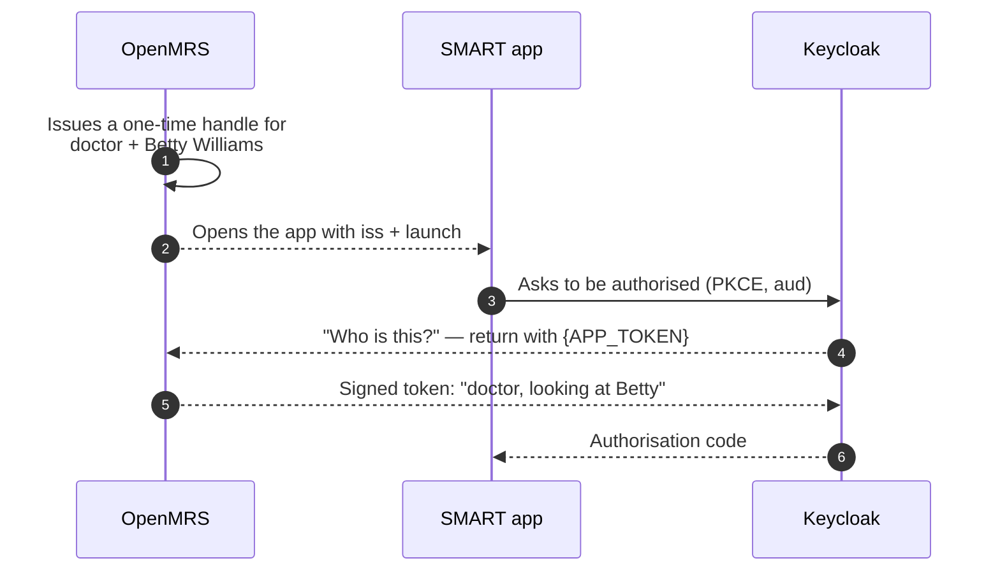

# The EHR launch, step by step

A clinician looking at a patient's chart opens a third-party app, and that app comes up already
showing the same patient — without a second sign-in and without anyone typing an identifier. This is
SMART App Launch's *EHR launch*, and this page walks the whole thing with screenshots from a running
stack.

Every screenshot here was taken by driving the flow in a real browser. To retake them, bring the
stack up, start the bundled test app, and run the capture script:

```bash
./up.sh
./smart-test-app.py &
cd ../openmrs-esm-smart-app-launch-app
npx playwright test --config e2e/playwright.config.ts capture-walkthrough
```

The script asserts at every step, so if the flow is broken the screenshots are never written.

## 1. Sign in to OpenMRS

Nothing SMART-specific yet. A clinician signs in with their ordinary OpenMRS credentials.


The username comes first, then the password on a second step.


Worth knowing, because it trips up automated walkthroughs: **the app shell will not render any route
until a login location is chosen.** A session alone is not enough — without a session location the
frontend shows this picker instead of whatever you asked for.


Those credentials are checked against the **OpenMRS user table**, not against a copy inside Keycloak.
The `openmrs-contrib-keycloak-auth` provider federates the same users to the authorization server, so
there is one set of credentials and one place to disable an account.

## 2. Open a patient's chart

The launch starts from a patient the clinician is already looking at — here Betty Williams. That
context is the whole point: the app is going to be handed *this* patient, not asked which one to open.


## 3. Find the launch action

Open the **Actions** menu on the patient banner. **Launch an app** sits at the bottom, alongside the
chart's own actions.


That entry is an extension contributed by the `openmrs-esm-smart-app-launch-app` frontend module into
the `patient-actions-slot`, which `esm-patient-banner-app` renders. It is not part of the patient
chart itself.

> **On configuring where it appears.** Slot placement is normally a distribution decision, made in
> `frontend/config-core_demo.json`. Be careful which slot you name: this version of the reference
> application renders only `patient-actions-slot` and `patient-search-actions-slot`, and configuration
> naming a slot nobody renders is discarded in silence — the action simply never appears, with nothing
> logged. `action-menu-patient-chart-items-slot` is one such name; the reference application's own
> demo config references it too, and that line is equally dead.

## 4. Choose the app

The dialog lists the apps this deployment has registered, each with a **Launch** button.


Two details in that screenshot are deliberate:

- **"You will not be asked to sign in again."** The clinician has already authenticated to OpenMRS,
  and the launch carries that identity across to the authorization server.
- **The list comes from `config/smart-apps.json`.** An app that is not registered cannot be launched
  at all. The launch endpoint is asked for an app by id and looks the address up; it used to take the
  address from a request parameter, which made it an open redirector for single-use launch handles.

## 5. What happens when Launch is clicked

Nothing appears on screen, which is the point: an EHR launch that stopped for a login form would defeat
its own purpose. Underneath, the browser is passed between three parties in about a second.



| Step | What it means |
|---|---|
| 1 | The module writes down who is launching and for which patient, then issues an opaque handle. Not the patient's id: that would be guessable and would collide between two launches for the same patient. |
| 2 | The app is told only *which* FHIR server and *that* a launch exists. Nothing about the patient. |
| 3 | A standard OAuth2 authorisation request, carrying the handle. |
| 4 | Instead of a login form, Keycloak sends the browser back into OpenMRS with a blank to fill in. |
| 5 | The request arrives with the OpenMRS session cookie, so the module knows it is `doctor`. It signs that fact, plus the patient, with the secret both sides share. Keycloak verifies the signature, not the session. |
| 6 | The app receives a code and trades it for a token. |

<details>
<summary>The raw redirect trace</summary>

Recorded during this walkthrough into [`launch-redirects.txt`](launch-redirects.txt); credentials
redacted, shape intact. Each `302` says "go here next".

```http
302 /openmrs/ms/smartEhrLaunchServlet?appId=test-app&patientId=c3ab5d9b-…
302 http://localhost:3000/?iss=…%2Fws%2Ffhir2%2FR4&launch=<handle>
302 …/openid-connect/auth?client_id=smartClient&response_type=code&code_challenge_method=S256&launch=<handle>
302 /openmrs/smartonfhir/smartAccessConfirmation?token=…%26app-token%3D%7BAPP_TOKEN%7D&launch=<handle>
302 …/realms/openmrs/login-actions/authenticate?session_code=…&app-token=<signed token>
200 http://localhost:3000/?state=…&code=<authorisation code>
```

</details>

## 6. The app has the patient


The token response carried the launch context, and the app used it to read the record over FHIR:

- **Granted scopes** — `openid launch profile fhirUser patient/Patient.rs`
- **Patient in launch context** — `c3ab5d9b-…`, the patient whose chart the launch started from
- **Token type** `Bearer`, expiring in **300s**

Note where the patient arrived: **in the token response, not in the access token's claims.** SMART
2.x puts launch context there, and an app that looks for a `patient` claim inside the JWT will find
nothing.

Then the app read `Patient/c3ab5d9b-…` from `/ws/fhir2/R4` with that bearer token and rendered the
name, identifier, gender and birth date. That read is the proof the whole chain worked: the token is
verified against the authorization server's published keys, `aud` is checked, and the bearer session
lasts exactly one request.

## What to do when it does not work

| Symptom | Where to look |
|---|---|
| No **Launch an app** in the Actions menu | Is the frontend module installed? `curl …/spa/importmap.json`. If a config file adds the extension to a slot, check that slot is one this version renders. |
| The dialog says no apps are available | `config/smart-apps.json` is missing or every entry lacks an `id` or `launchUrl`. |
| The launch stops at a Keycloak error page | `./realm/check-realm.py`, then `docker compose logs keycloak`. A realm that imported cleanly can still be wired wrong. |
| The app gets a token but every FHIR call answers 401 | `aud` in `config/smart-oauth2.json` must match what the app sends, and the bearer scheme must be registered in `openmrs-runtime.properties`. |
| The app receives no patient | The `launch` scope needs its context mapper. `./realm/check-realm.py` checks this. |

`./verify-env.sh` walks both launch flows and asserts 63 separate things about them; run it before
debugging by hand.
