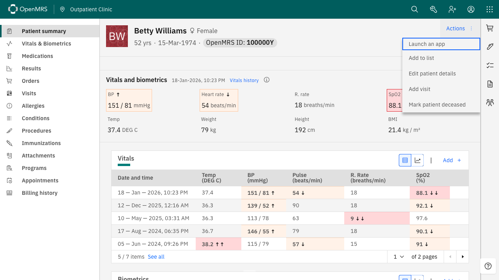

# An EHR launch, step by step

A clinician working in a patient's chart opens a SMART application, and it comes up already holding that
patient's record — no second sign-in, nothing typed. This is that flow, photographed against this stack.

Every screenshot below was taken by `capture-walkthrough.spec.ts` in
[openmrs-esm-smart-app-launch-app](https://github.com/mherman22/openmrs-esm-smart-app-launch-app), which
asserts at each step before it photographs. A walkthrough illustrated with pictures of a broken flow is
worse than no walkthrough.

## 1 · Sign in to OpenMRS


An ordinary OpenMRS login. Worth noticing what does *not* happen here: nothing contacts Keycloak. At this
point the browser holds one cookie, `JSESSIONID`, and no Keycloak session exists at all. That matters
later.


## 2 · Open a patient's chart


The chart shows this patient's vitals as OpenMRS records them: blood pressure 151/81, pulse 54, oxygen
saturation 88.1%, and a BMI of 21.4. Keep those numbers in mind.

## 3 · Launch an app



**Launch an app** comes from the frontend module, placed in the chart's action menu by
`frontend/config-core_demo.json`. The apps it offers come from the server — `backend/smart-apps.json` —
not from the browser, so a deployment decides what may be launched and a page cannot ask for more.


## 4 · The app opens, already holding the patient


No login screen appeared. The application knows which patient to show, and it did not ask.

Look at what it is doing. It is not displaying the record back:

- **four of six latest vitals are outside their reference range**, named, with blood pressure staged the
  way the 2017 ACC/AHA guideline stages it — 151 systolic is stage 2, 81 diastolic is stage 1
- **two vitals are shown without a verdict**, because weight and height have no adult reference range and
  saying nothing is better than implying one
- **the body mass index is derived.** OpenMRS stores height and weight and no BMI, so 21.4 was computed
  by the application from paired measurements taken on the same day


Those numbers agree with the chart in step 2 — same pressures, same pulse, same saturation, same BMI —
which is the point: two independent readings of one record.

## What happened on the wire

Recorded during this walkthrough into [`launch-redirects.txt`](launch-redirects.txt), with credentials
redacted and the shape kept:

```
302  /openmrs/ms/smartEhrLaunchServlet?appId=vitals-review&patientId=…
200  localhost:3000/launch.html?iss=…&launch=<launch handle>
302  keycloak /protocol/openid-connect/auth?response_type=code&client_id=smartClient&…
302  /openmrs/smartonfhir/smartAccessConfirmation?token=…&launch=<launch handle>
302  keycloak /login-actions/authenticate?…&app-token=<signed launch token>
200  localhost:3000/index.html?state=<state>&code=<authorization code>
```

Six hops, and the interesting one is the fourth.

**Hop 1.** OpenMRS mints a launch handle — 256 bits from a CSPRNG, single-use, and bound to the clinician
who minted it — and redirects the browser to the application's launch URL, which it looks up in the app
registry rather than accepting from the request.

**Hops 2–3.** The application reads `{iss}/.well-known/smart-configuration` and redirects to the
authorization server with `aud`, the launch handle, and a PKCE `S256` challenge.

**Hop 4 is the part people ask about.** Keycloak has to authenticate the clinician, and it has never seen
them — remember, no Keycloak session was created at login. Rather than showing a password form, it sends
the browser to OpenMRS, which reads its *own* session cookie and signs a short-lived token naming the
clinician with a secret both sides hold.

**Hop 5.** Keycloak verifies that token with the same key and treats it as the login. The EHR vouches;
Keycloak does not peek.

**Hop 6.** An authorization code reaches the application, which exchanges it for an access token. The
launch context arrives in the token response body, where SMART says it belongs:

```json
{ "access_token": "…", "token_type": "Bearer", "expires_in": 300,
  "patient": "9ff54c5b-…", "scope": "openid launch fhirUser patient/Patient.rs …" }
```

The id_token carries `fhirUser` — `Practitioner/705f5791-…` — so the application also knows *who* is
using it.

## If there is no OpenMRS session

Then hop 4 has nobody to vouch for. OpenMRS returns no token, Keycloak stops waiting for one, and the
flow falls through to a password form — the ordinary way in. This is worth stating because it is the case
that made the launch silent: the silence is not single sign-on, it is an OpenMRS session cookie doing the
work. Take the cookie away and Keycloak asks.
