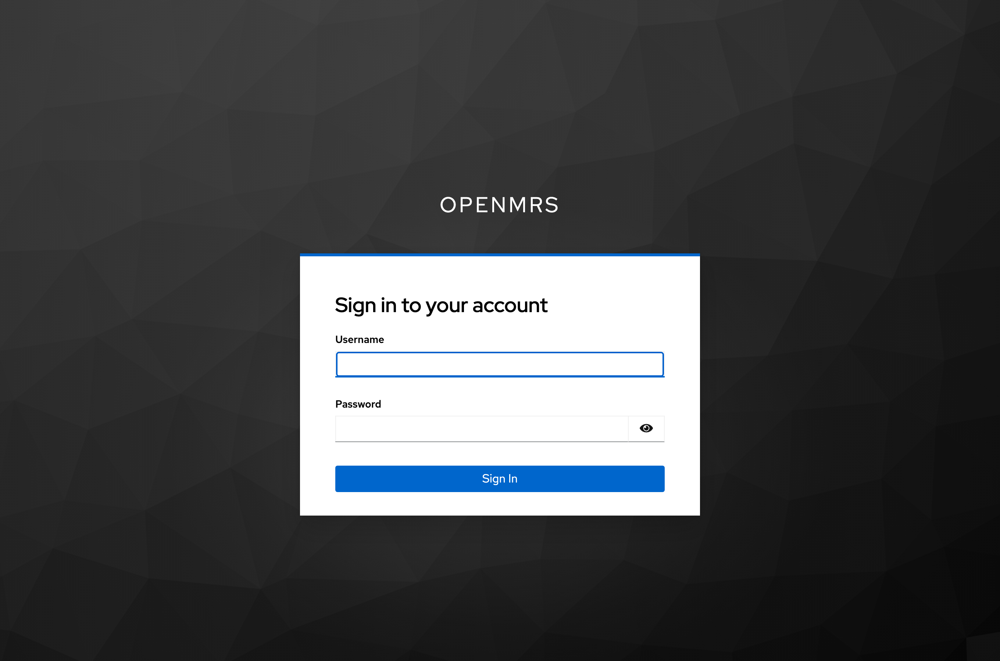
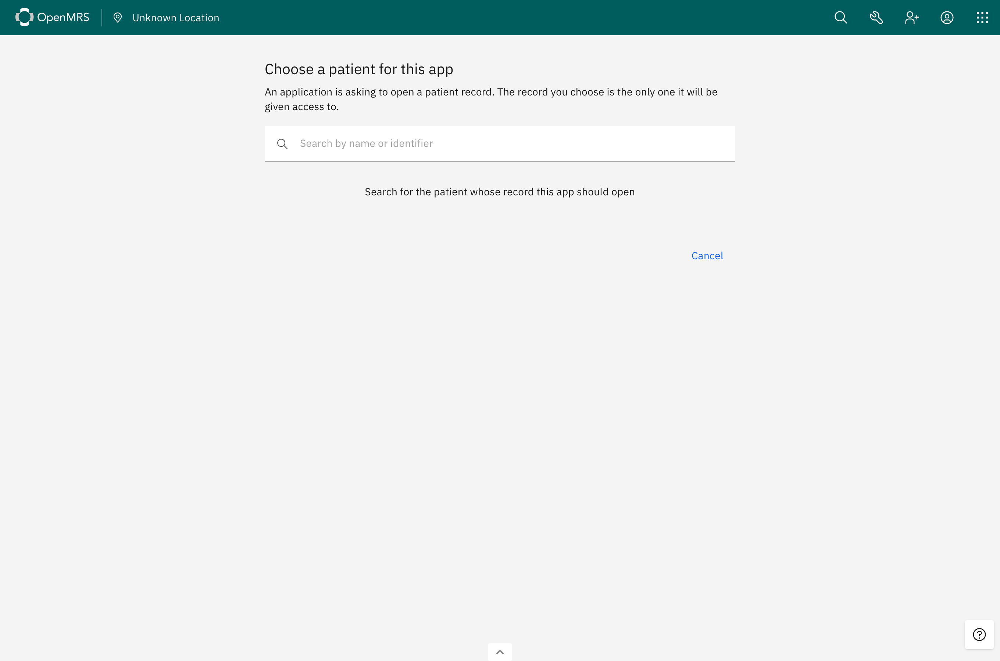
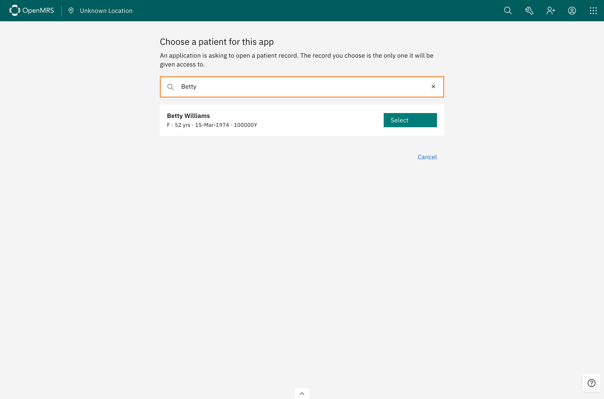
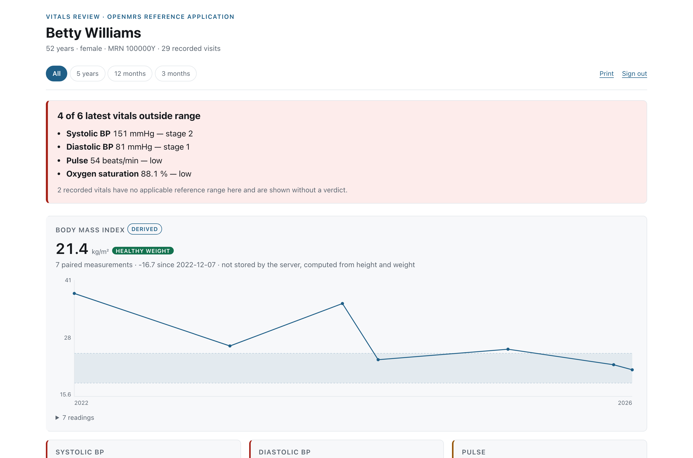

# A standalone launch, step by step

The other launch. Nobody is signed in to OpenMRS, no chart is open, and there is no EHR involved — someone
opens the application from a bookmark. Everything the EHR supplied in
[the EHR launch](ehr-launch.md) now has to be established from nothing: who the user is, and which
patient they mean.

The end state is identical. Same token, same `patient` in the response, same FHIR calls. What differs is
one screen at the front and one piece of configuration behind it.

## 1 · Open the application with nothing

```
http://localhost:3000/launch.html
```

No `iss`, no `launch`. An EHR launch arrives with both; here there is neither, so the application reads
the FHIR server from its own configuration — `SMART_ISS` on the container — and fetches
`.well-known/smart-configuration` from it exactly as before.

If `SMART_ISS` is empty the launch stops here and says so. That is deliberate: guessing a FHIR server
would send a clinician's credentials to a server nobody chose. The distribution sets it, so the standalone
launch works out of the box.

The one substantive difference in the authorize request is the scope. An EHR launch asks for `launch`,
meaning *accept the context the EHR already established*. A standalone launch asks for `launch/patient`,
meaning *establish one*.

## 2 · Sign in — the screen an EHR launch never shows



This is the visible difference between the two flows, and the reason
[§ *If there is no OpenMRS session*](ehr-launch.md) in the other walkthrough exists. In an EHR launch,
Keycloak asks OpenMRS who is signed in, OpenMRS answers with a signed assertion, and no form is ever
rendered. Here there is nobody to ask, so `smart-access-authenticator` reports `attempted`, the flow falls
through to the next alternative, and Keycloak renders its own login form.

The credentials are ordinary OpenMRS credentials. Keycloak does not have its own copy of them — the user
federation provider reads the OpenMRS `users` table over JDBC and checks the password hash there, so there
is no second directory and nothing to keep in step.

## 3 · Choose a patient





Signed in, the flow still has no patient, which is what `launch/patient` asked for. Keycloak hands the
browser to OpenMRS at `/ms/smartPatientSelection`, which lands on a real OpenMRS session and forwards to
the picker the frontend module renders at `/spa/smart/select-patient`.

That detour through a server endpoint matters: an SPA route on its own cannot establish the session the
picker needs to search patients, which is why the launch goes to a servlet first and the SPA second.

The choice comes back to Keycloak in a token signed with the same shared secret used in the other
direction during an EHR launch.

> **The picker finds nothing until the search index is built.** This one will stop you: FHIR reads work
> immediately, but the Lucene index starts empty on a fresh database, so the search box returns no results
> and there is no patient to select. Rebuild it from *Administration → Search Index*, or:
>
> ```bash
> curl -su admin:Admin123 -X POST -H 'Content-Type: application/json' -d '{}' \
>   http://localhost/openmrs/ws/rest/v1/searchindexupdate
> ```
>
> It answers `204` and takes a few seconds on demo data. An EHR launch does not need it, because the
> patient comes from the chart rather than from a search.

## 4 · The application opens with the patient you chose



From here nothing is different. The token response carries `patient`, the application reads that patient's
record over FHIR with its bearer token, and the review renders exactly as it does after an EHR launch.

## What happened on the wire

Eight document navigations, against the six of an EHR launch. Recorded in full, with the credentials
redacted, in [`standalone-redirects.txt`](standalone-redirects.txt):

```
200  localhost:3000/launch.html                                  no iss, no launch
200  .../protocol/openid-connect/auth   scope=launch/patient     the login form
302  .../login-actions/authenticate                              credentials accepted
302  localhost/openmrs/ms/smartPatientSelection?token=…          Keycloak asks OpenMRS for a patient
200  localhost/openmrs/spa/smart/select-patient?token=…          the picker
302  localhost/openmrs/ms/smartLaunchOptionSelected?…&patientId= the choice goes back
302  .../login-actions/action-token?key=…&app-token=…            Keycloak resumes the flow
200  localhost:3000/index.html?state=…&code=…                    the app completes the exchange
```

Two hops there are worth naming. **`smartLaunchOptionSelected`** is where the chosen patient re-enters
the flow — the same servlet that answers `501` if a standalone launch asks for an encounter instead.
And the **action token** on the next hop is Keycloak's own resume mechanism: the `token` parameter it sent
to OpenMRS in hop four was a signed, single-use URL back into this exact authentication session, which is
what lets a detour through another server continue rather than restart.

Compare it with [the EHR launch's chain](launch-redirects.txt). The shape is the same — the browser bounces
between the app, Keycloak and OpenMRS — but the middle hop runs the other way. In an EHR launch OpenMRS
tells Keycloak *who the user is*; here Keycloak asks OpenMRS *which patient*.

There is a full sequence diagram of both in [architecture.md](architecture.md).

## What this needs that an EHR launch does not

| | EHR launch | Standalone launch |
|---|---|---|
| `iss` | supplied by the EHR | from `SMART_ISS` on the app container |
| Scope | `launch` | `launch/patient` |
| Who identifies the user | OpenMRS, with a signed assertion | Keycloak's login form, against the OpenMRS user table |
| Who chooses the patient | the clinician, before launching | the clinician, mid-launch, in the picker |
| Login page | never shown | always shown |

Both are advertised in the discovery document — `launch-ehr`, `launch-standalone`,
`context-ehr-patient`, `context-standalone-patient` — and each was claimed only after being walked in a
browser.

## What is refused

A standalone launch asking for `launch/encounter` is answered **501**. Establishing a visit needs a
selection screen that does not exist, and `context-standalone-encounter` is deliberately absent from the
capability list rather than advertised and broken. An EHR launch naming a visit does return it.
